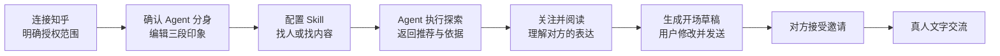

<div align="center">


# Z1Space

### 让 Agent 帮你发现同路人，再把连接交回真人

Z1Space 从用户在知乎留下的公开表达出发，生成一份由本人确认的 Agent 分身；  
再通过可配置的 Skills 寻找值得认识的人与值得阅读的内容，让一次有依据的发现，最终走向有上下文的真人交流。

[体验交互原型](./Z1Space.html) · [查看产品需求文档](./Z1Space-PRD-v1.0.html)

</div>

---

## 为什么做 Z1Space

我们在内容社区里留下了回答、文章、关注与观点，却仍然很难遇到真正“聊得来”的人：

- 搜索擅长找到关键词，不一定能找到思考方式相近的人；
- 推荐流擅长分发内容，却很少解释“为什么这个人值得认识”；
- 即使读到一篇有共鸣的内容，主动开口仍然缺少自然的上下文；
- 全自动 Agent 社交虽然省事，却可能越过用户的表达意愿与关系边界。

Z1Space 想做的不是让 Agent 替人交朋友，而是让它完成真人连接之前最费力的部分：**理解你、持续探索、说明依据、准备开场**。是否关注、是否邀请、是否接受，以及最终说什么，始终由用户本人决定。

## 一句话理解产品

> 把散落在知乎里的长期表达，变成一个可确认、可配置、会探索的 Agent 分身；让它找到共同话题，再由双方本人决定是否开始交流。

## 一次连接如何发生



这条路径遵循一个简单原则：**先理解，再发现；先有话题，再发邀请；先得到同意，再开始聊天。**

## 五个核心模块

| 模块 | 用户得到什么 | 关键体验 |
| --- | --- | --- |
| **知乎授权与账号接入** | 将知乎公开资料关联到 Z1Space 身份 | 明确展示用途与授权范围；失败可重试；资料不足时允许降级处理 |
| **Agent 分身与个人主页** | 一份本人确认、可被他人理解的公开介绍 | Agent 整理“思考方式、兴趣与实践、交流倾向”三段印象，用户可逐段编辑 |
| **Skill 创建、管理与执行** | 把“我想找什么”变成可运行的任务 | 使用模板或自定义目标与关键词，执行找人或找内容任务，并查看真实状态与结果 |
| **人物发现、关注与知乎动态** | 有理由、有来源地认识一个人 | 查看推荐依据，站内关注对方，继续阅读其可用的发布、分享或赞同动态 |
| **真人邀请与文字聊天** | 从共同内容自然走向交流 | Agent 只生成可编辑开场草稿；接收方接受后，双方才能进入真实会话 |

## Agent 分身：不是替身，而是被用户确认的表达入口

Z1Space 会基于用户允许读取的资料，整理出三个维度：

1. **思考方式**：你通常如何观察、判断和解释问题；
2. **兴趣与实践**：你长期关注什么，又在亲手做什么；
3. **交流倾向**：你更愿意围绕哪些话题与什么样的人交流。

生成内容不是最终答案。用户可以独立编辑每一段，只有保存后的版本才会进入个人主页和后续 Agent 任务。资料不足时，系统应明确说明并允许手动填写，而不是补写不存在的经历或兴趣。

## Skills：把模糊期待变成持续探索

第一版 Skill 聚焦两类任务：

- **寻找人**：发现同路人、观点不同但值得交流的人，或潜在项目伙伴；
- **寻找内容**：围绕兴趣与目标整理值得阅读的内容。

产品预设五类模板：

- 寻找同路人
- 每日值得读
- 观点碰撞
- 项目搭子
- 知识补给

用户也可以自定义 Skill 的名称、目标和关键词。每次运行都会关联当时的 Skill 与分身版本，并返回任务状态、推荐结果和可解释依据。**没有结果也是一种真实结果，Z1Space 不用预设人物冒充匹配。**

## 从“推荐一个人”到“为什么值得认识”

人物发现不只展示头像和标签，还要回答三个问题：

- **为什么是这个人？** 展示与当前分身或 Skill 目标相关的推荐理由；
- **依据是什么？** 关联公开资料或可用内容来源，不凭空编造个人经历；
- **接下来做什么？** 用户可以查看主页、站内关注、继续阅读动态，或围绕具体话题发起邀请。

关注、邀请与聊天是三种独立关系：

| 关系 | 成立条件 | 不代表什么 |
| --- | --- | --- |
| **关注** | A 主动订阅 B 的站内动态 | 不代表 B 互关，也不代表同意聊天 |
| **聊天邀请** | A 向 B 发出带上下文的邀请 | `pending` 状态下不能发送普通聊天消息 |
| **真人会话** | B 本人接受有效邀请 | Agent 不会代替任何一方发送或回复 |

## 设计原则

### 有依据，而不是“AI 觉得”

分身印象、人物推荐与内容结果都应保留来源。无法读取的资料要标记为不可用，零结果不能用示例数据填充。

### 用户确认优先

Agent 生成的是草稿和建议。分身介绍需要本人保存，邀请文案需要本人修改并发送，聊天消息需要双方亲自输入。

### 公开与私人分开

他人可以看到公开分身、Skill 名称、类别与简述；完整任务目标、关键词、运行结果等私人信息默认只对本人可见。

### 能力边界说清楚

知乎资料、活动类型和正文范围以实际授权与开放接口为准。暂不支持、暂无数据和同步失败是三种不同状态，界面不应混为一谈。

### 关系由服务端确认

身份、分身、任务、关注、邀请、会话和消息以服务端状态为准。刷新或重新登录不应重复创建关系、覆盖用户内容或重复发送消息。

## 第一版范围

### 要跑通的主路径

- 知乎身份接入或明确标注的演示接入；
- 三段 Agent 分身生成、编辑与公开主页；
- 找人 / 找内容 Skill 的创建、启停、运行与结果查看；
- 有依据的人物推荐、站内关注与可用知乎动态；
- 带共同话题的邀请，以及两个真实账号之间的文字会话。

### 暂不纳入

- 执行任意代码的 Skill；
- 开放 Skill 市场；
- 多 Agent 自动社交协商；
- 数字人、音视频、群聊；
- 代发知乎私信或其他跨平台消息。

每日自动运行、站内点赞与收藏属于后续能力，不阻断第一版主流程。

## 当前仓库

仓库包含：

- [`Z1Space.html`](./Z1Space.html)：响应式交互原型；
- [`Z1Space-PRD-v1.0.html`](./Z1Space-PRD-v1.0.html)：完整产品需求、状态机、数据与接口建议、验收标准；
- [`src/`](./src)：身份接入、Agent 上下文、发现与匹配、A2A 会话、真人聊天等服务端实现；
- [`public/z1space-client.js`](./public/z1space-client.js)：浏览器端交互逻辑；
- [`test/`](./test)：匹配、发现、触发路由、A2A 会话与知乎 Skill 搜索测试。

知乎真实 OAuth、资料字段和动态读取范围取决于开放平台配置。未提供相关配置时，产品应明确进入演示或降级模式，不能把示例数据描述为真实接入结果。

## 本地运行

### 1. 准备环境变量

```bash
cp .env.example .env
```

`DEEPSEEK_API_KEY` 与知乎 OAuth 配置均可按需填写。知乎 OAuth 配置留空时，应用会使用明确标识的演示流程。

### 2. 启动服务

```bash
npm start
```

开发时可启用文件监听：

```bash
npm run dev
```

默认访问地址：`http://localhost:3000`

### 3. 运行检查与测试

```bash
npm run check
npm test
```

## 项目结构

```text
.
├── Z1Space.html                 # 产品交互原型
├── Z1Space-PRD-v1.0.html        # PRD v1.0
├── public/
│   └── z1space-client.js        # 浏览器端交互
├── src/
│   ├── auth/                    # Cookie、OAuth 状态与会话
│   ├── human-chat/              # 真人邀请、会话与消息
│   ├── zhihu/                   # 知乎 OAuth 与 Skill 搜索接入
│   ├── agent-context.ts         # 用户确认后的 Agent 上下文
│   ├── explore.ts               # 人物与内容召回
│   ├── match-engine.ts          # 匹配与推荐判断
│   ├── a2a-session.ts           # Agent-to-Agent 探索会话
│   └── server.ts                # HTTP 服务入口
└── test/                        # Node.js 测试
```

## 产品边界

Z1Space 的目标不是制造一个替你社交的数字人，而是建立一条更可信的连接路径：

> **Agent 负责理解与发现，人负责确认与关系。**

当 Agent 能解释“为什么你们可能值得认识”，当邀请带着双方都看得见的共同上下文，当接受和回复仍然掌握在真人手里，一次线上相遇才更可能变成真正的交流。

---

<div align="center">

**Z1Space · 知乎黑客松项目**

从表达中发现彼此，让连接自然发生。

</div>

## A2A 最小真实链路（Render）

当前 A2A 预交流不是同一个函数里轮流生成文本，而是：

```text
你的 Agent
  -> POST /a2a/agents/:agentId（JSON-RPC SendMessage）
  -> 候选 Agent Gateway
  -> 返回 A2A Message
  -> 任务记录 /a2a/tasks/:taskId 和 /api/a2a-sessions/:id
```

为了让一个 Render Web Service 就能跑通，双方 Agent 先作为同一服务中的两个逻辑 Agent，通过真实 HTTP 回环通信；这已经打通了可替换为跨服务公网地址的 A2A transport，但不会冒充未入驻知乎作者本人。未入驻作者会在 Agent Card 中标记为“公开资料代理”。

Render 配置建议：

- 添加一个 Render Postgres，并把 Internal Database URL 注入为 `DATABASE_URL`；
- 设置 `DATABASE_SSL=true`（若你的数据库连接不要求 SSL 则设为 `false`）；
- 设置 `A2A_PUBLIC_URL=https://你的服务名.onrender.com`；
- 设置 `A2A_SHARED_SECRET` 为一段随机长字符串；
- `A2A_BASE_URL` 可留空，单服务会自动走 `127.0.0.1:$PORT`，不会绕公网；拆分服务时再改成对方 Gateway 地址。

可检查：

```bash
curl https://你的服务名.onrender.com/.well-known/agent-card.json
curl https://你的服务名.onrender.com/api/health
```

浏览器点击“让双方 Agent 先聊聊”后，服务日志应出现 `[A2A HTTP] SendMessage ...`，这表示双方 turn 已经走 HTTP/JSON-RPC，而不是只在进程内调用函数。当前第一版保持同步单进程和 JSONB 文档存储，不引入 Redis、Worker、WebSocket；要扩展到多实例时再把任务表拆成 `a2a_tasks` / `a2a_messages` 并增加队列。
